# Lab 1: Create Host Pool using Getting Started Wizard

## **Scenario**

Contoso is planning to set up its infrastructure on Azure. As a first step, Contoso needs you to provision a host pool which is the main component of AVD. The creation of a host pool also includes session hosts, a default application group, and a workspace.

## **Overview**

A Host Pool is a collection of Azure virtual machines that register to Azure Virtual Desktop as session hosts when you run the Azure Virtual Desktop agent. All session host virtual machines in a host pool should be sourced from the same image for a consistent user experience. To start host pool creation, we will login to the Azure portal.

## Exercise 1: Create Host Pool using Getting Started Wizard

In this exercise, we will be creating the Host pool.

1. On the **Azure portal** search for **Azure Virtual Desktop** **(1)** in the search bar and select **Azure Virtual Desktop** **(2)** from the suggestions.

   

1. On the Azure Virtual Destop Page, **Click** on the **Create a host pool**.

   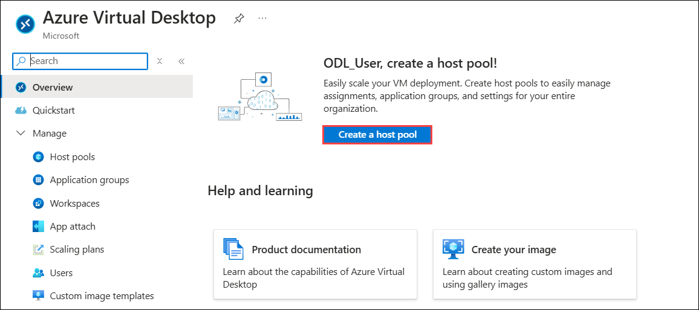

1. On **Create a host pool** page, provide the information as mentioned below,

   **A. Project Details:**

   - Subscription: **Leave it as default (1)**
   - Resource Group: Select ***AVD-HostPool-RG-avd (2)***
   - Host pool name: **GS-AVD-HP (3)**
   - Location: Select **<inject key="Region" enableCopy="false"/> (4)** from the drop-down list.
   - Preferred app group type: **Desktop (5)**

      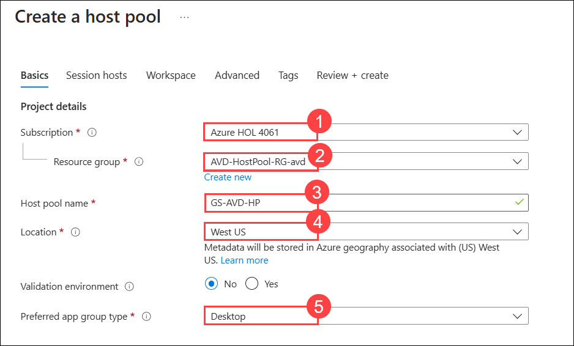

      >**Note**: The region you selected in the lab might be different from the region mentioned in the screenshot.

1. In the **Host pool details** section, enter the required information and then click **Next: Session hosts > (10)** to proceed.

   - Host pool type: **Pooled (6)**
   - Create Session Host Configuration: **No (7)**
   - Load balancing algorithm: **Breadth-first (8)**
   - Max session limit: **16 (9)**

      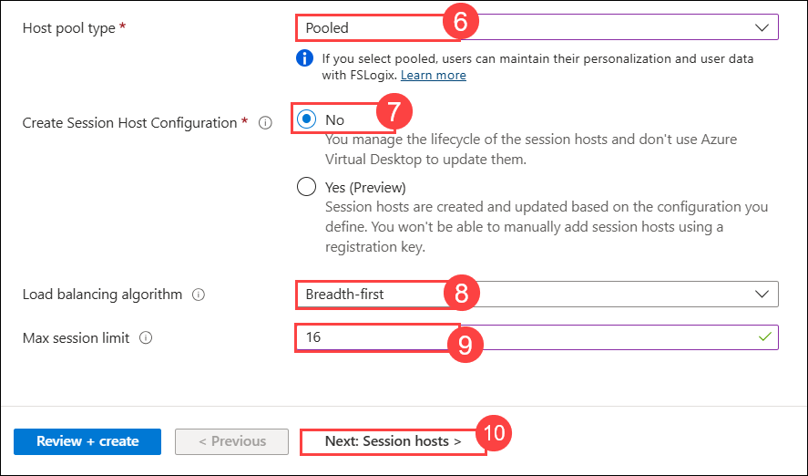

1. On the **Session hosts** section, enter the required information as follow:

   - Add virtual machines: **Yes (1)**
   - Resource Group prefix: Enter ***AVD-HostPool-RG-avd (2)***
   - Name prefix: **AVD-HP01-SH (3)**
   - Virtual machine type: **Azure virtual machine (4)**
   - Virtual machine location: Select **<inject key="Region" enableCopy="false"/> (5)** from the drop-down list.
   - Availability options: **No infrastructure redundancy required (6)**
   - Security type: **Trusted launch virtual machines (7)**

      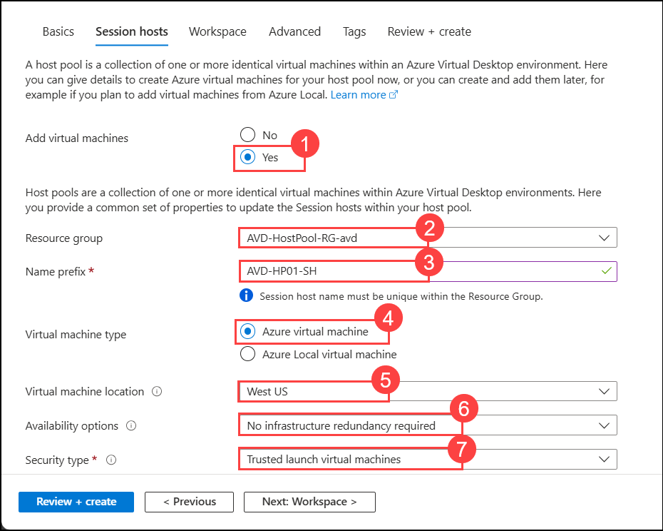

      >**Note**: The region you selected in the lab might be different from the region mentioned in the screenshot.

1. In the **Image**, click on **See all images** to choose the required images.

   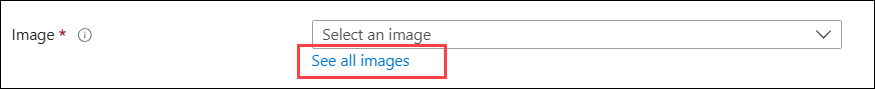

1. In the Search bar Search for **Windows multi-session (1)**, then under **Windows multi-session + Microsoft 365 Apps** choose **Select (2)** and then select **Windows 11 Enterprise multi-session + Microsoft 365 Apps, Version 22H2** *(choose from dropdown)*

   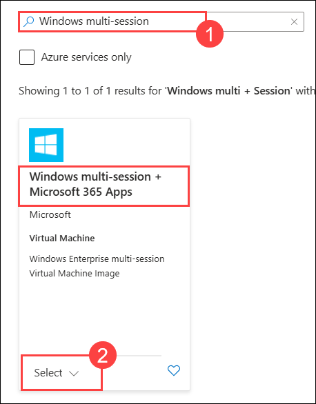
   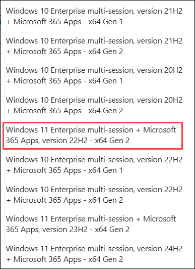

1. Virtual machine size: **Standard D4s v4**. *Click on **Change Size**, then select **D4s_v4** and click on **Select** as shown below*

   

1. Provide the information as mentioned below:
   
   - Number of VMs: **2 (1)**
   - OS disk type: **Standard HDD (2)**
   - OS disk size: **Resize to 128 GiB (P10) (3)**

      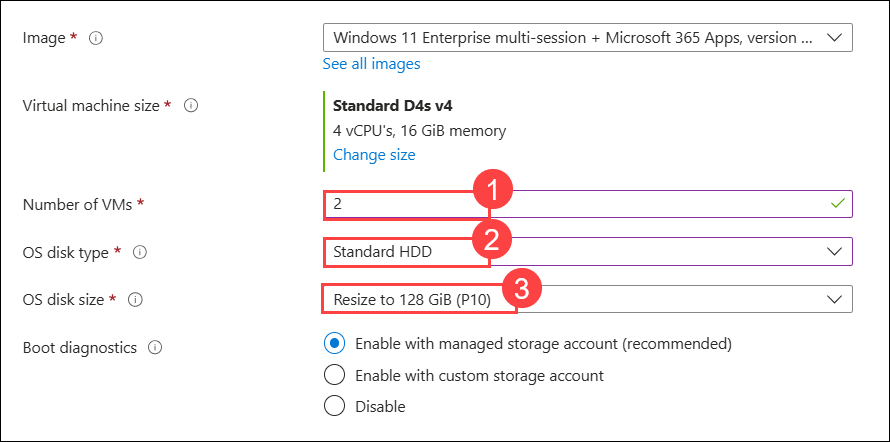

1. On the **Network and security** section, enter the required information as follow:

   - Virtual Network: **aadds-vnet (1)** *(choose from dropdown)*
   - Subnet: **sessionhosts-subnet(10.0.1.0/24) (2)** *(choose from dropdown)*
   - Network security group type: **Basic (3)**

      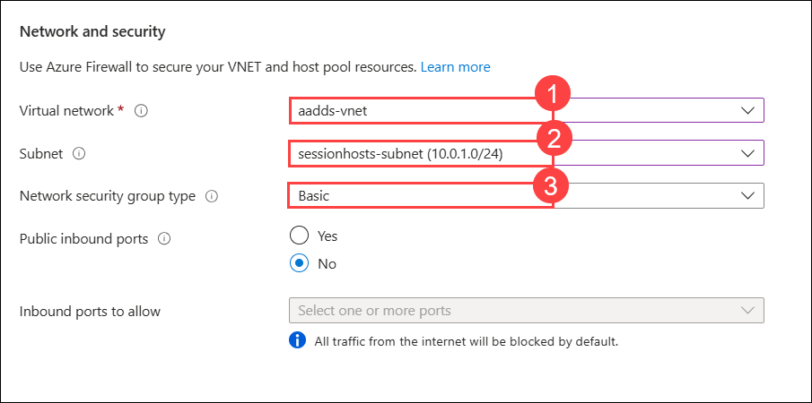

1. Enter the required details for **Domain to join** and **Virtual machine administrator account** as specified below, then click **Next: Workspace > (8)**

   - Select which directory you would like to join: **Active Directory (1)**
   - AD domain join UPN: **<inject key="AzureAdUserEmail" /> (2)**
   - Password: *Paste the password* **<inject key="AzureAdUserPassword" /> (3)**
   - Confirm password: **<inject key="AzureAdUserPassword" /> (4)**
   - User name: **odl_user_<inject key="DeploymentID" enableCopy="false"/>(5)**
   - Password: *Paste the password* **<inject key="AzureAdUserPassword" /> (6)**
   - Confirm password: **<inject key="AzureAdUserPassword" /> (7)**

      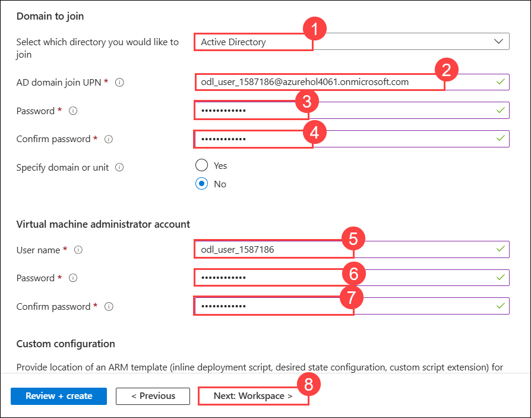

1. In the **Workspace section**, select **Yes (1)** for **Register desktop app group**.  

2. For **To this workspace**, click on **Create new (2)**.

3. Enter **GS-AVD-WS (3)** as the workspace name.

4. Click **OK (4)** to confirm.

   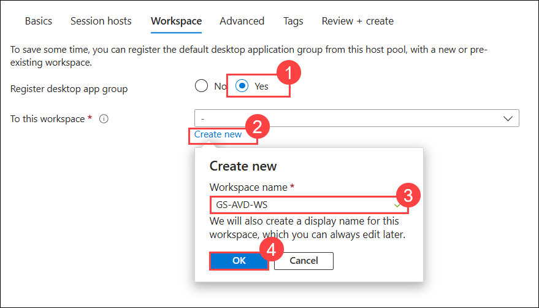

1. Click on **Review + Create**, then click **Create**.

   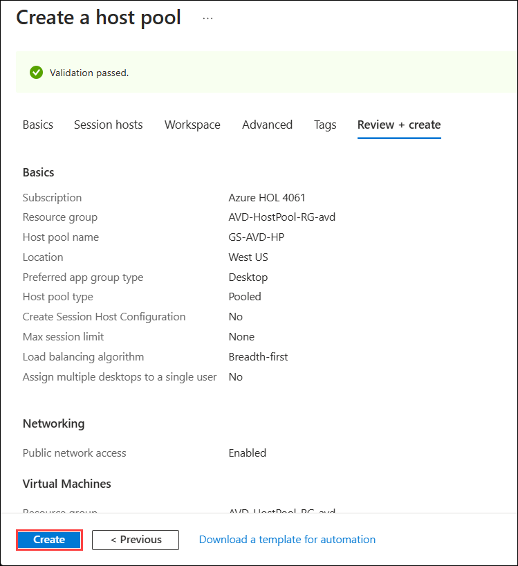

   >**NOTE**: Usually it takes 20 minutes to get deployed successfully. Sometimes it might take up to 90 minutes.
   
1. Once the deployment succeeds, it will look similar to the image shown below: 
   - Click on **AVD-HostPool-RG-avd** to navigate to the resource group.

   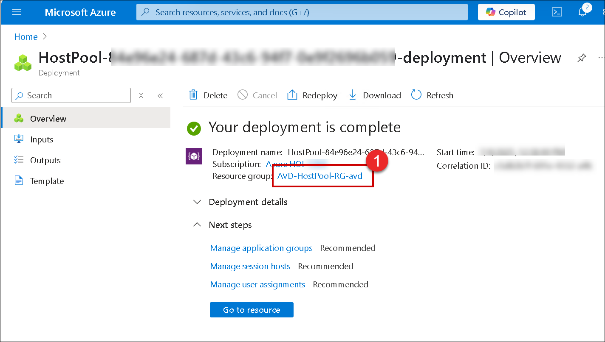

1. Select **GS-AVD-HP** host pool.

   
   
1. It will take you to the **Host pool**. The resources created are as follows,

    - **Host Pool**: 1 (GS-AVD-HP)
    - **Session Host**: 2 (AVD-HP01-SH-0, AVD-HP01-SH-1)
    - **Application Group**: 1 (GS-AVD-HP-DAG)
    - **Application**: 1 (SessionDesktop)
    - **Workspace**: 1 (GS-AVD-WS)

      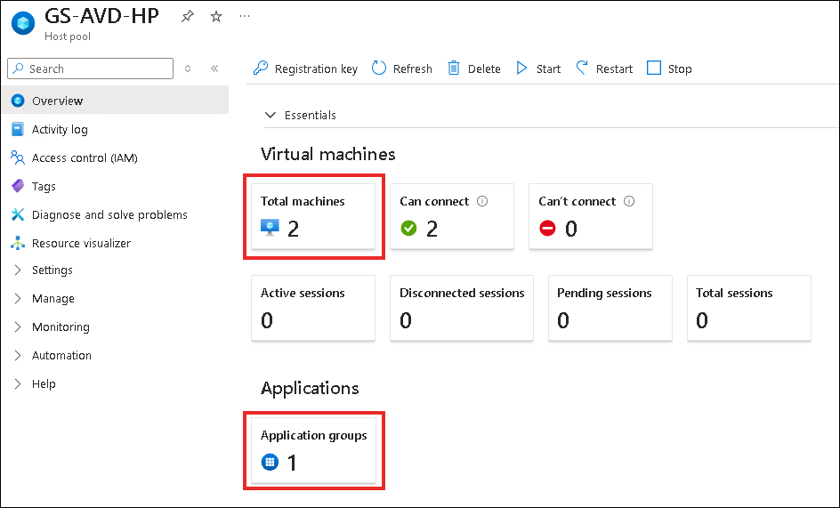

> **Congratulations** on completing the task! Now, it's time to validate it. Here are the steps:
- If you receive a success message, you can proceed to the next task.
- If not, carefully read the error message and retry the step, following the instructions in the lab guide.
- If you need any assistance, please contact us at cloudlabs-support@spektrasystems.com. We are available 24/7 to help you out.

<validation step="97d211ae-121b-445b-a278-054cda35de33" />   
   
* Click on the **Next** button present in the bottom-right corner of this lab guide.
   
   
