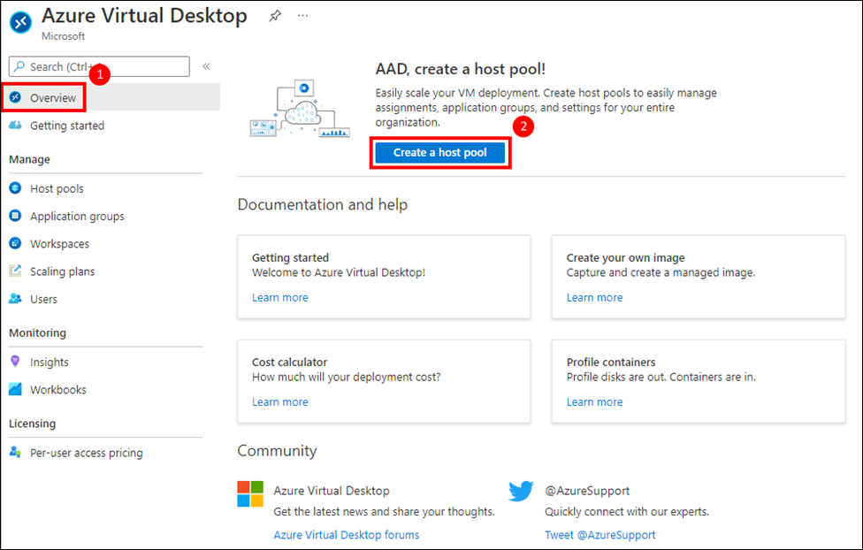
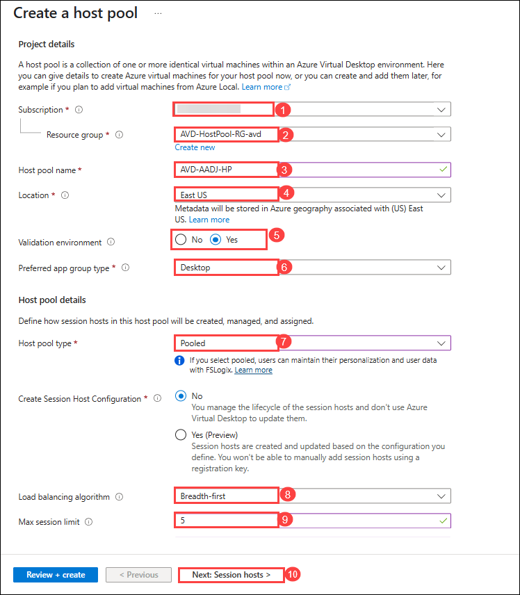
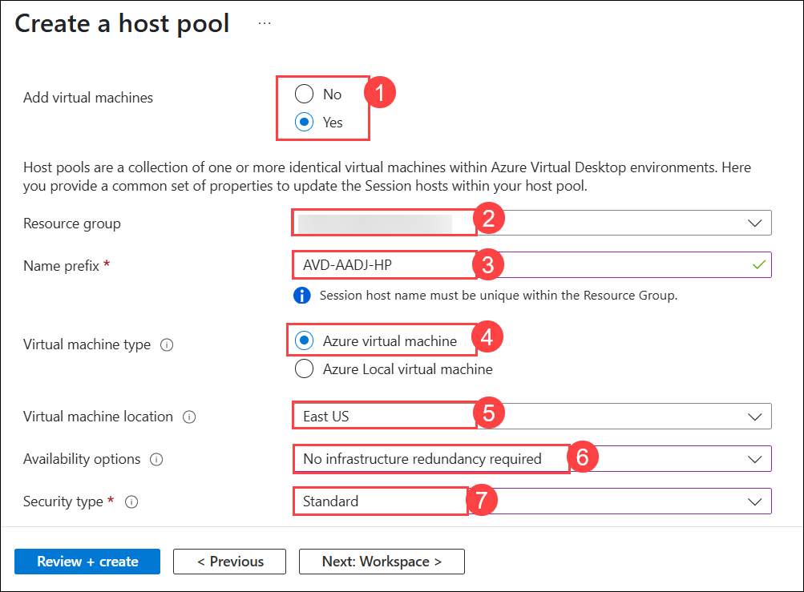
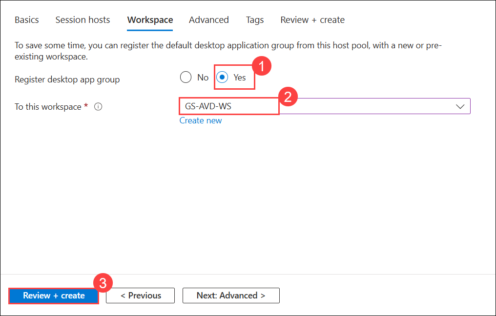
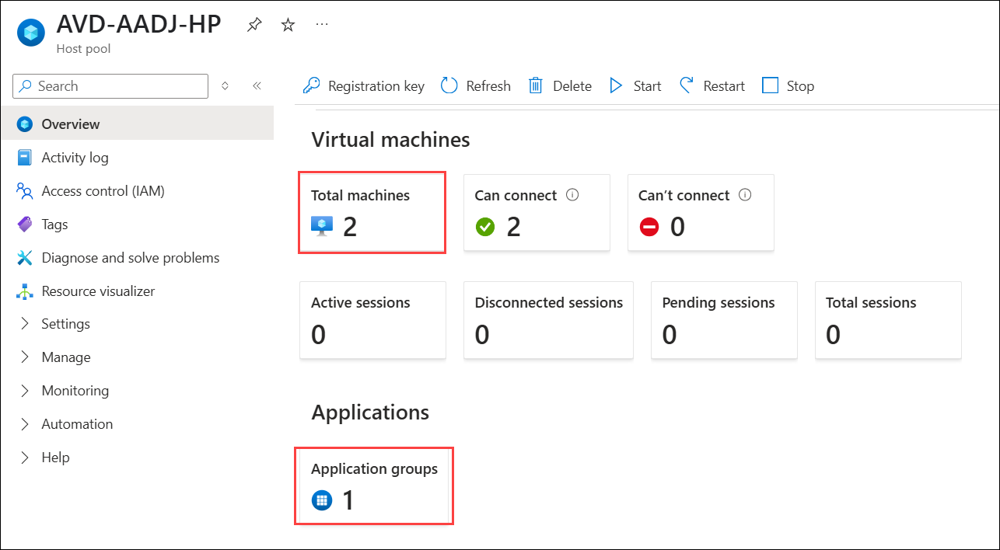

# Lab 14: Microsoft Entra ID Domain Join (Read Only) 

### Estimated Duration: 20 Minutes

## **Scenario**

 Contoso is planning to set up its infrastructure on Azure. As a first step, Contoso needs you to provision a host pool which is the main component of AVD. Creation of the host pool also includes session hosts domain joined through Microsoft Entra ID, default application group, and a workspace.

## **Overview**

A Host Pool is a collection of Azure virtual machines that register to Azure Virtual Desktop as session hosts when you run the Azure Virtual Desktop agent. All session host virtual machines in a host pool should be sourced from the same image for a consistent user experience. To start with, we will log in to the Azure portal.

## Exercise 1: Create a Host Pool using the Getting Started Wizard

In this exercise, We'll be creating the Host pool using **Getting Started Wizard** using minimum effort and information.

1. On the **Azure portal** search for **Azure Virtual Desktop** in the **search bar** **(1)** and select **Azure Virtual Desktop** **(2)** from the suggestions.

   

1. On the AVD **Overview page (1)**, click on **Create a host pool (2)**.

   

1. On the **Basics** tab, provide the following information and click **Next: Session hosts >** **(10)**.

   - Subscription: **Leave it as default (1)**
   - Resource Group prefix: Enter ***AVD-HostPool-RG-avd (2)***
   - Host pool name: **AVD-AADJ-HP (3)**
   - Location: Select **<inject key="Region" enableCopy="false"/> (4)** from the drop-down list.
   - Preferred app group type: **Desktop (5)**
   - Host pool type: **Pooled (6)**
   - Create Session Host Configuration: **No (7)**
   - Load balancing algorithm: **Breadth-first (8)**
   - Max session limit: **5 (9)**

        

1. On the **Virtual Machines** tab, provide the following information :

   - Add virtual machines: **Yes (1)**
   - Resource Group prefix: Enter ***AVD-HostPool-RG-avd (2)***
   - Name prefix: **AVD-AADJ-HP (3)**
   - Virtual machine type: **Azure virtual machine (4)**
   - Virtual machine location: Select **<inject key="Region" enableCopy="false"/> (5)** from the drop-down list.
   - Availability options: **No infrastructure redundancy required (6)**
   - Security type: **Standard (7)**

        

1. In the **Image**, click on **See all images** to choose the required images.

   

1. In the Search bar Search for **Windows multi-session (1)**, then under **Windows multi-session + Microsoft 365 Apps** choose **Select (2)** and then select **Windows 11 Enterprise multi-session + Microsoft 365 Apps, Version 22H2** *(choose from dropdown)*

   
   

1. Virtual machine size: **Standard D4s v4**. *Click on **Change Size**, then select **D4s_v4** and click on **Select** as shown below*

   

1. Provide the information as mentioned below:
   
   - Number of VMs: **2 (1)**
   - OS disk type: **Standard HDD (2)**
   - OS disk size: **Resize to 128 GiB (P10) (3)**

      

1. On the **Network and security** section, enter the required information as follow:

   - Virtual Network: **aadds-vnet (1)** *(choose from dropdown)*
   - Subnet: **sessionhosts-subnet(10.0.1.0/24) (2)** *(choose from dropdown)*
   - Network security group type: **Basic (3)**

      

1. **Domain to join**

    - Select which directory you would like to join: **Microsoft Entra ID (1)**
    - Enroll VM with Intune: **No (2)**

        

1. **Virtual Machine Administrator account**

    - User name: **demouser (1)**
    - Password: **Password.1!! (2)**
    - Confirm password: **Password.1!!** **(3)**
    - Click on **Next : Workspace > (4)**

        

1. On the Workspace tab, provide the following information and click **Review + create (3)**:

    - Register desktop app group: **Yes (1)**
    - To this workspace: **GS-AVD-WS (2)**

        

1. Verify the information and click **Create**.

    

    > **NOTE:** Usually it takes 20 mins to get deployed successfully. Sometimes it might take up to 90 minutes.

1. Once the deployment is successful, click on **Go to resource**.

    

1. It will take you to the Host pool. The following resources were created:

    - Host Pool: 1 (AVD-AADJ-HP)
    - Session Host: 2 (AVD-AADJ-SH-0, AVD-AADJ-SH-1)
    - Application Group: 1 (AVD-AADJ-HP-DAG)
    - Workspace: 1 (GS-AVD-WS)

        

Now, click on Next from the lower right corner to move on to the next page.

  