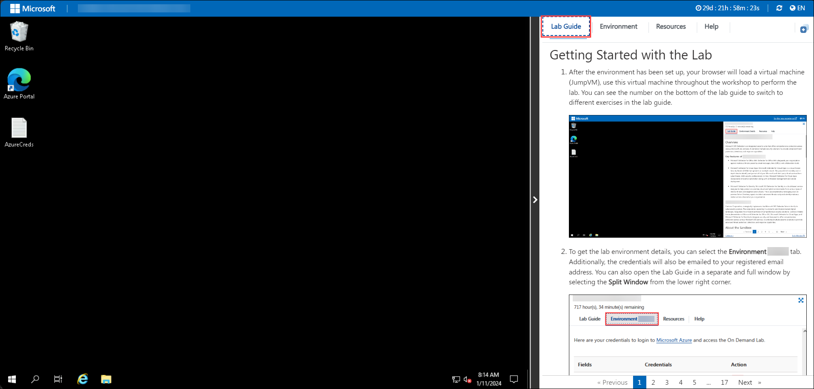
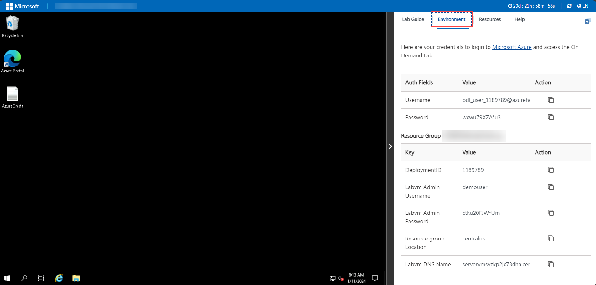
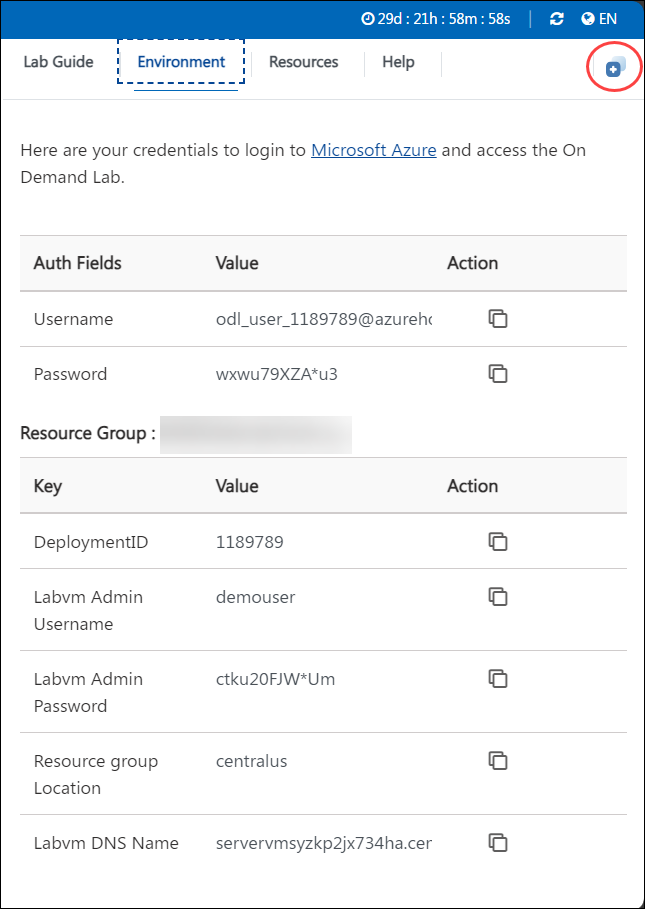
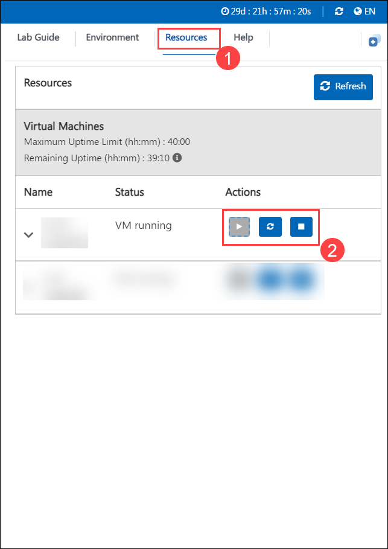
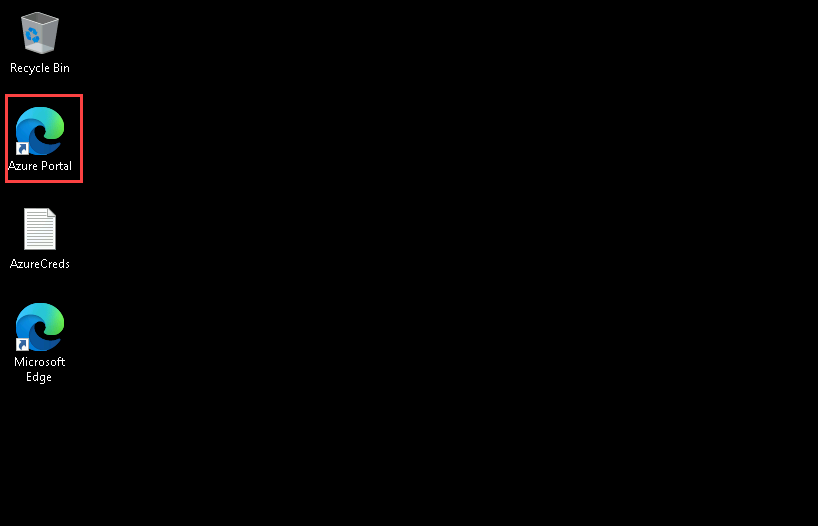
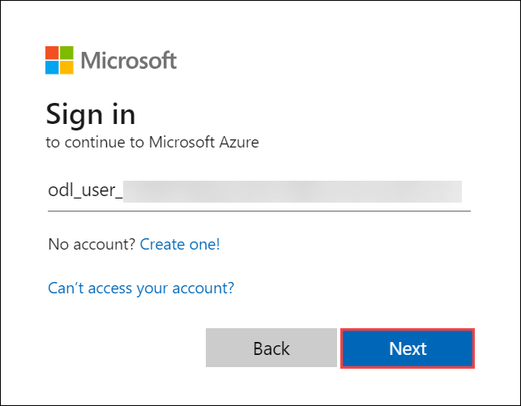

# Azure Virtual Desktop

## Overall Estimated Duration: 8 hours

## Overview

Contoso IT Consulting Services is a fast-growing technology consulting firm headquartered in Los Angeles, California. With expansion across North America and a distributed workforce that includes remote consultants, Contoso IT is seeking scalable and secure ways to deliver critical IT resources to its employees.

To support this growth, Contoso wants to implement a proof of concept (POC) that evaluates Azure Virtual Desktop (AVD) as a platform for securely delivering virtual desktops and applications to its workforce, regardless of their location.

In this hands-on lab, you’ll take on the role of an Azure Consultant to help Contoso’s IT team deploy and configure an AVD environment that supports secure remote work and centralized management.

## Objective

This lab is designed to equip participants with hands-on experience in deploying and managing an Azure Virtual Desktop (AVD) environment, including host pool creation, application publishing, user access, performance monitoring, cost optimization, and security. Participants will work through real-world scenarios to build a robust virtual desktop infrastructure.

* **Create Host Pool using Getting Started Wizard**: This hands-on exercise aims to create an Azure Virtual Desktop host pool for pooled desktops using the Getting Started wizard. Participants will provision session hosts integrated with FSLogix profile containers for a non-persistent desktop experience, leveraging Azure Active Directory Domain Services for identity and authentication.

* **Monitoring using Log Analytics**: This hands-on exercise aims to set up a Log Analytics workspace and enable diagnostics for AVD. Participants will configure monitoring for session hosts and host pools to support troubleshooting, performance analysis, and operational insights.

* **Create Application Groups and Assign to Users**: This hands-on exercise aims to create application groups and assign published applications or desktops to users. Participants will define access for different user roles and publish remote resources to end users.

* **Access Published Applications and Desktops using Browser**: This hands-on exercise aims to validate access to published desktops and applications through a web browser. Participants will log into the AVD web client and verify the user experience in a browser-based session.

* **Access Published Applications and Desktops using AVD Desktop Client:** 
This hands-on exercise aims to validate AVD session access using the Remote Desktop Client. Participants will install and configure the AVD desktop client to connect to assigned desktops and apps.

* **Setup FSLogix**: This hands-on exercise aims to configure FSLogix profile containers for user session persistence. Participants will provision Azure Files with Active Directory authentication, apply permissions, and integrate with AVD session hosts.

* **Load Balancing Methods**: This hands-on exercise aims to demonstrate user distribution across session hosts using Breadth-first and Depth-first load balancing algorithms. Participants will analyze session behavior and optimize user allocation strategies.

* **Auto Scaling**: This hands-on exercise aims to configure scaling plans for AVD session hosts. Participants will implement rules to scale virtual machines up or down based on usage patterns, optimizing performance and cost.

* **Cost Optimizations**:
This hands-on exercise aims to enable and test the Start VM on Connect feature. Participants will reduce compute costs by ensuring session hosts only power on when users initiate a session.

* **Multimedia Redirection for AVD**:
This hands-on exercise aims to enable multimedia redirection and Microsoft Teams optimization for AVD. Participants will configure session hosts and test Teams functionality in a remote desktop scenario.

* **Security Modules**:
This hands-on exercise aims to enhance security by implementing MFA, Conditional Access policies, screen capture protection, and AppLocker rules. Participants will secure user sessions and restrict unauthorized access.

* **App Masking**:
This hands-on exercise aims to configure application masking using FSLogix to control access to specific applications. Participants will tailor the app experience based on user identity or group membership.

* **Migration Tools**:
This hands-on exercise provides documentation and walkthroughs for available migration tools in Azure Virtual Desktop. Participants will explore supported tools and methods for AVD migrations.

* **Microsoft Entra ID Domain Join**:
This hands-on exercise provides an overview of joining AVD session hosts directly to Microsoft Entra ID. Participants will understand the benefits of Entra ID domain join including support for modern authentication and FSLogix profiles.

* **Monitoring using Azure Monitor for AVD**: This hands-on exercise aims to use Azure Monitor to visualize AVD performance and diagnostics. Participants will access data collected from Log Analytics to track session behavior and host pool health.

### Prerequisites

Participants should have:

* Basic understanding of Azure Virtual Desktop (AVD) components, such as Host Pools, Session Hosts, and Application Groups
* Familiarity with Azure Active Directory (AAD) and Azure AD Domain Services (AAD DS) for authentication and identity management
* Knowledge of Windows Virtual Machines and how they are deployed and managed in Azure
* Understanding of FSLogix Profile Containers and their use in non-persistent session environments
* Basic knowledge of Azure Networking, including virtual networks and subnets
* Experience with Azure Storage, particularly Azure Files and configuring SMB access
* Familiarity with monitoring tools like Log Analytics Workspace and Azure Monitor for performance and diagnostics
* Awareness of load balancing methods and auto-scaling concepts in virtual desktop environments
* Understanding of cost optimization features like Start VM on Connect and scaling plans
* Experience with Microsoft Teams configuration for AVD, including multimedia redirection
* Familiarity with basic security configurations, such as MFA, Conditional Access, and App Locker

# Getting Started with your Azure Virtual Desktop Workshop

Welcome to your Azure Virtual Desktop Workshop! We've prepared a seamless environment for you to explore and learn about Azure Virtual Desktop services. Let's begin by making the most of this experience:

## Accessing Your Lab Environment

Once you're ready to dive in, your virtual machine and lab guide will be right at your fingertips within your web browser.
 

### Virtual Machine & Lab Guide
 
Your virtual machine is your workhorse throughout the workshop. The lab guide is your roadmap to success.
 
## Exploring Your Lab Resources
 
To get a better understanding of your lab resources and credentials, navigate to the **Environment** tab.
 

 
## Utilizing the Split Window Feature
 
For convenience, you can open the lab guide in a separate window by selecting the **Split Window** button from the top right corner.
 

 
## Managing Your Virtual Machine
 
Feel free to start, stop, or restart your virtual machine as needed from the **Resources** tab. Your experience is in your hands!
 
	

## Let's Get Started with Azure Portal
 
1. On your virtual machine, click on the Azure Portal icon as shown below:
 
    
 
2. You'll see the **Sign into Microsoft Azure** tab. Here, enter your credentials:
 
   - **Email/Username:** <inject key="AzureAdUserEmail"></inject>
 
    
 
3. Next, provide your password:
 
   - **Password:** <inject key="AzureAdUserPassword"></inject>
 
   
 
4. If prompted to stay signed in, you can click "No."
 
5. If a **Welcome to Microsoft Azure** pop-up window appears, simply click **Cancel** to skip the tour.

4. Now in the Azure portal, click on **Resource Groups** present under *Navigate*.

   

5. You will see a list of resource groups as shown in the image below. Click on **AVD-RG** to open it.

   
   
6. Click "Next" from the bottom right corner to embark on your Lab journey!
 
     

Now you're all set to explore the powerful world of technology. Feel free to reach out if you have any questions along the way. Enjoy your workshop!
