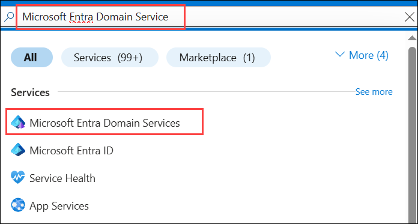
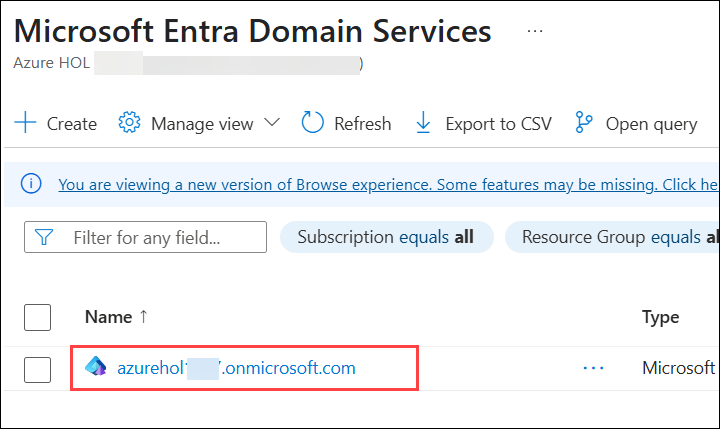
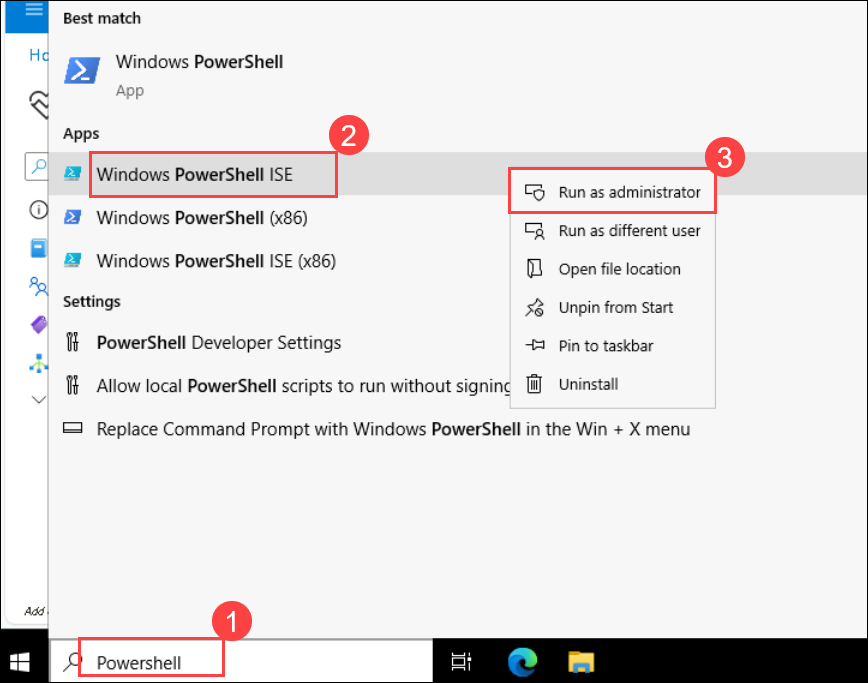
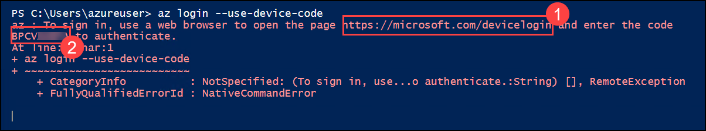
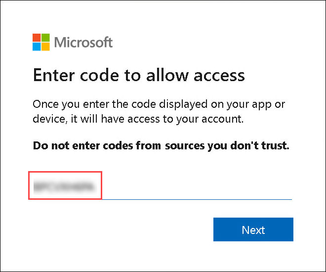
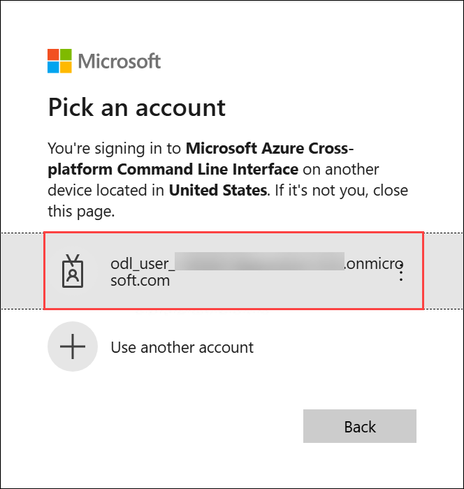
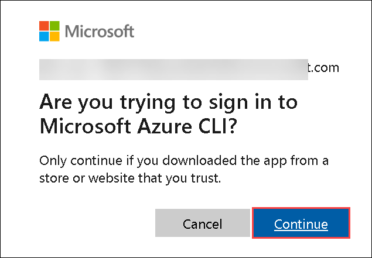
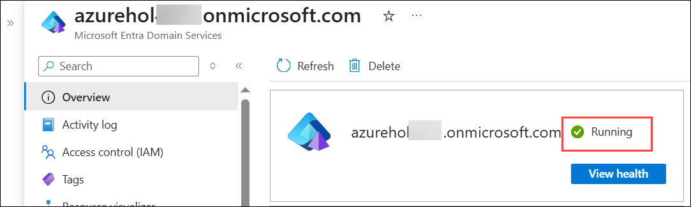

 
## Microsoft Entra Domain Services

1. In the **Azure portal**, search for and select **Microsoft Entra Domain Services**.

   

1. From the list, locate and **copy the name** of your Domain Service.

   

1. In the **LabVM**, in the Windows Search bar type **Powershell (1)** and select **Windows PowerShell ISE (2)**. Right click on it, then **Run as Administrator (3)**.

    

1. **Login to Azure:** Use the command to sign into your Azure account via device code authentication. Paste the generated URL **(1)** in the browser and enter the device code **(2)** when prompted.

    ```
    az login --use-device-code
    ```

   >**Note:** If you're experiencing issues while running the az login command, please execute the following command first
   
   ```
   Invoke-WebRequest -Uri https://aka.ms/installazurecliwindows -OutFile .\AzureCLI.msi; Start-Process msiexec.exe -ArgumentList '/i AzureCLI.msi /quiet' -NoNewWindow -Wait; Remove-Item .\AzureCLI.msi
   ```

   ```
   https://microsoft.com/devicelogin
   ```

   

1. After running the command, Azure will display a code and a URL. Copy the URL, paste it into your web browser, and then provide the code. Click **Next** to proceed.

   

1. Once the browser opens the Azure login page, choose your Azure account and click **Continue**.

   

1. Click on **Continue**, if prompted **Are you trying to sign in to Microsoft Azure CLI**.

      
 
   

1. After successfully logging in, you'll be authenticated. Now, switch back to PowerShell to run the below command.

   >**Note:** Replace `<domain-service-name>` with the name of your **Microsoft Entra Domain Services** instance.

   ```
   Update-AzADDomainService -Name <domain-service-name> -ResourceGroupName "AVD-RG" -DomainSecuritySettingTlsV1 Disabled
   ```

   >**Note:** The process may take up to 10 minutes to complete. Once finished, proceed to the next step.

1. Once the command completes, navigate back to your Domain Service and refresh the page. You should now see that the service is running.

   >**Note:** If the service is still not running, please wait for 5 minutes and refresh the page again.

   
